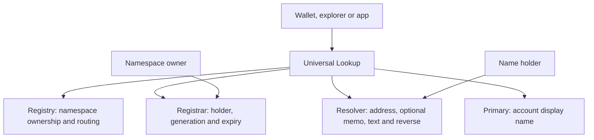

Soran names have exactly two labels: `alice.nova` consists of the name label `alice` and namespace `nova`. There are no deeper subdomains in this ABI.

## Contract roles



Universal Lookup stores configuration, not a duplicate names database. Registry, Registrar, Resolver and Primary remain the on-chain sources for their respective state. Writes still target the contract that owns that state.

A **namespace owner** controls issuance under its namespace policy. A **holder** owns an issued name under that policy. A **recipient** is the effective payment destination. These can be different addresses.

## Namespace contract addresses

Each namespace has its own Registrar and Resolver. Individual names such as `alice.nova` are records within those contracts; they do not each receive a separate contract address.

The current Registry reports `deployment_salt_version() == 1`. It derives each deployment address from the namespace node, the contract's role and the caller's 32-byte nonce, within the network and Registry's Stellar deployment context. Reusing a nonce for another namespace or the other role produces a different address. Deployment still requires namespace-owner authorization and the Registry's eligibility checks.

| Registry read | Result |
| --- | --- |
| `deployment_salt_version()` | Salt derivation version `1` |
| `predict_registrar(node:BytesN<32>, salt:BytesN<32>)` | Registrar address for that namespace node and nonce |
| `predict_resolver(node:BytesN<32>, salt:BytesN<32>)` | Resolver address for that namespace node and nonce |

The `salt` argument is the caller's nonce; the Registry derives the scoped deployment salt internally. Use the prediction methods rather than the previous Registry's raw-salt formula. Prediction is read-only: it neither reserves an address nor proves ownership or deployment. Check confirmed deployment and current Registry routing before publishing an address as active.

The Registry enforces namespace and role separation. It does not require a `SORAN` prefix, so direct contract callers can choose nonces that produce ordinary contract addresses. A branded prefix is not proof of authenticity. See [the current deployment and historical records](/reference/release-status).

## Labels

Each canonical label is 1–63 bytes of lowercase ASCII letters, digits and interior hyphens. Leading/trailing hyphens, whitespace and non-ASCII input are invalid. A full name is at most 127 bytes.

The contracts require canonical lowercase input. The SDK accepts ASCII uppercase and lowercases it **after rejecting non-ASCII**. It does not trim whitespace or normalize Unicode lookalikes. Punycode is stored literally; avoid rendering a decoded lookalike as verified identity.

## Namehash

```text
namespaceNode = sha256(ZERO32 || sha256(namespace))
nameNode      = sha256(namespaceNode || sha256(label))
```

Labels are canonical bytes. Nodes are 32 raw bytes; a 64-character hex rendering is not interchangeable with those bytes. The SDK's `namehash(namespace)` and `node(name)` each return a `Promise<Uint8Array>` containing those 32 bytes. Metadata fields such as `NameMetadata.node` instead use a hex string.

```ts
const namespaceBytes = await soran.namehash("nova");
const nameBytes = await soran.node("alice.nova");
const toHex = (bytes: Uint8Array) =>
  Array.from(bytes, byte => byte.toString(16).padStart(2, "0")).join("");
const namespaceHex = toHex(namespaceBytes);
const nameHex = toHex(nameBytes);
```

Use the raw bytes for contract `BytesN<32>` arguments. Use the explicit hex rendering for API fields that request a namespace or name node as hex.

## Generations

Issuance, reissue, reclaim and accepted transfer advance a name's ownership generation. Resolver records from a previous generation cannot become the new holder's records. Read current generation and lifecycle metadata through `name_metadata`; use `resolve_payment` for the complete effective destination.

## The two clocks

| Clock | Meaning |
| --- | --- |
| Ownership expiry | `expires_at == 0` means no ownership deadline; otherwise expiry occurs when ledger time is **strictly greater** than `expires_at` |
| Storage TTL | Stellar's availability/rent clock for ledger entries; archival does not itself transfer ownership |

At the exact finite expiry timestamp, a name remains active. No expiry alone does not establish [permanence](/concepts/ownership-guarantees).

Archived data may require a funded restoration transaction before a simulation can answer. Read-only resolution does not guarantee automatic restoration. Treat restore requirements and unavailable data as failures to obtain a current answer, never as proof that a name is unowned or memo-free. Keepers can extend relevant contract and record TTLs without changing ownership.

Hosted dormancy labels are separate from verified on-chain archival. An indexed last-known value can support a history display; it cannot replace current payment instructions.
