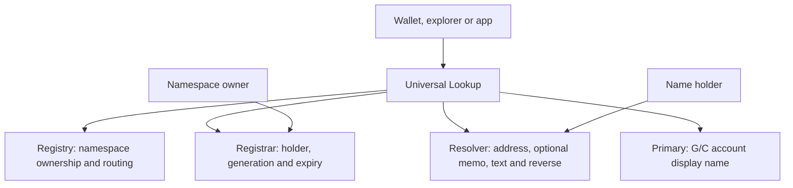

In `alice.nova`, `nova` is the **namespace** and `alice` is the **name label**. The namespace owner sets the rules for issuing names. Each issued name has a holder and a payment destination, which can be different addresses. Soran supports exactly these two labels; it does not support deeper subdomains.

## Contract roles



Apps read through Universal Lookup, which follows the namespace's current contracts. Registry stores namespace ownership and routing. Registrar stores name ownership and lifecycle. Resolver stores payment and profile records, plus G/C reverse selections. Primary stores G/C account display-name selections. Universal Lookup also stores the separate elections for complete M addresses.

| Role | What it controls |
| --- | --- |
| Namespace owner | Issuance and namespace settings under the contract policy |
| Holder | An issued name and its records under that policy |
| Recipient | The account or contract receiving payments; destination-account authorization controls display-name elections |

## Namespace contract addresses

Each namespace has its own Registrar and Resolver. Individual names such as `alice.nova` are records within those contracts; they do not each receive a separate contract address.

The current Registry uses salt version `1` to derive addresses from the namespace node, contract role and a caller-supplied 32-byte nonce. The network and Registry also determine the deployment context. Reusing the nonce for another namespace or role produces a different address.

| Registry read | Result |
| --- | --- |
| `deployment_salt_version()` | Salt derivation version `1` |
| `predict_registrar(node:BytesN<32>, salt:BytesN<32>)` | Registrar address for that namespace node and nonce |
| `predict_resolver(node:BytesN<32>, salt:BytesN<32>)` | Resolver address for that namespace node and nonce |

Pass your nonce as `salt` to these prediction methods. Prediction does not reserve or deploy an address. Deployment requires namespace-owner authorization and Registry eligibility checks. Confirm deployment and Registry routing before publishing an address as active.

The console can [prepare branded addresses](/platform/issuing-names#automatic-branded-contract-addresses), but Registry does not require a `SORAN` prefix. Verify the deployed address through Registry; a prefix alone does not prove authenticity.

## Labels

Each canonical label is 1–63 bytes of lowercase ASCII letters, digits and interior hyphens. Leading/trailing hyphens, whitespace and non-ASCII input are invalid. A full name is at most 127 bytes.

The contracts require canonical lowercase input. The SDK accepts ASCII uppercase and lowercases it **after rejecting non-ASCII**. It does not trim whitespace or normalize Unicode lookalikes. Punycode is stored literally; avoid rendering a decoded lookalike as verified identity.

## Namehash

```text
namespaceNode = sha256(ZERO32 || sha256(namespace))
nameNode      = sha256(namespaceNode || sha256(label))
```

Labels are canonical bytes. Nodes are 32 raw bytes; a 64-character hex rendering is not interchangeable with those bytes. The SDK's `namehash(namespace)` and `node(name)` each return a `Promise<Uint8Array>` containing those 32 bytes. Metadata fields such as `NameMetadata.node` instead use a hex string.

```ts
const namespaceBytes = await soran.namehash("nova");
const nameBytes = await soran.node("alice.nova");
const toHex = (bytes: Uint8Array) =>
  Array.from(bytes, byte => byte.toString(16).padStart(2, "0")).join("");
const namespaceHex = toHex(namespaceBytes);
const nameHex = toHex(nameBytes);
```

Use the raw bytes for contract `BytesN<32>` arguments. Use the explicit hex rendering for API fields that request a namespace or name node as hex.

## Generations

Each issuance, reissue, reclaim or accepted transfer advances the name's **generation**, an ownership counter. Records from the previous generation do not become the new holder's records. Read generation and lifecycle details with `name_metadata`; read the complete payment instruction with `resolve_destination`.

## The two clocks

| Clock | Meaning |
| --- | --- |
| Ownership expiry | `expires_at == 0` means no ownership deadline; otherwise expiry occurs when ledger time is **strictly greater** than `expires_at` |
| Storage TTL | Stellar's availability/rent clock for ledger entries; archival does not itself transfer ownership |

At the exact finite expiry timestamp, a name remains active. No expiry alone does not establish [permanence](/concepts/ownership-guarantees).

Archived data may need a funded restoration transaction before a read can succeed. Read-only resolution does not guarantee restoration. An unavailable answer does not establish that a name is unowned or memo-free. Keepers can extend contract and record TTLs without changing ownership.

The hosted service's **cold** label indicates dormancy, not verified on-chain archival. A last-known value is useful for history, but payments need a current instruction.
